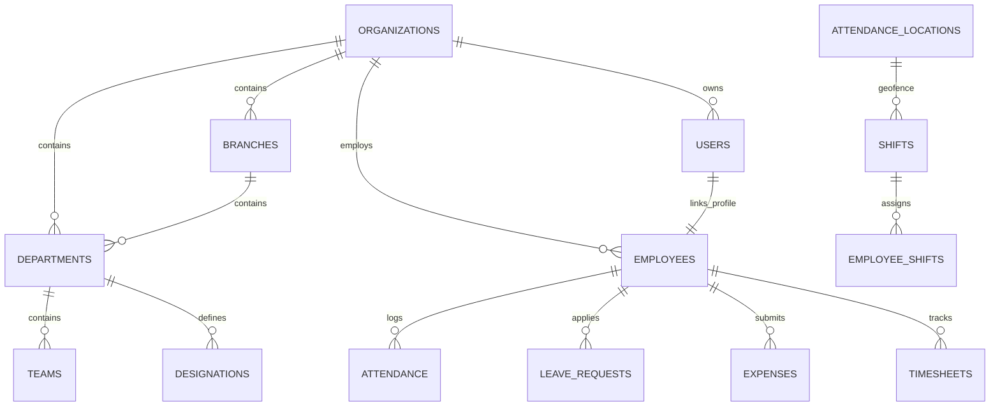

# THEIAKSHI ENTERPRISE HRMS — MASTER SYSTEM & TECHNICAL REFERENCE MAP
> **Living Technical Source Map & Architecture Reference**  
> *Last Updated: August 14, 2026 | Branch: `main` | Commit: `ee290356345d56a0a311696af385c22152118698`*
> 
> *This document is the authoritative technical source map for THEIAKSHI ENTERPRISE. Any future application change that affects pages, modules, APIs, database schema, forms, RBAC, authentication, dependencies, or deployment MUST follow the 20 mandatory rules below and update this document.*

---

## MANDATORY CHANGE IMPACT & LIVING SYSTEM MAP RULES

1. **Rule 1 — Never Modify Only the Requested File Blindly:** Always inspect `THEIAKSHI_SYSTEM_MAP.md`, target files, imports, API calls, routes, repositories, database schema, and tests before modifying code.
2. **Rule 2 — Follow the Complete Dependency Chain:** Trace `UI -> Component -> Page -> API Client -> HTTP Endpoint -> Backend Route -> Controller/Service -> Repository -> SQL -> DB Table -> DB Column -> Foreign Keys -> Other Modules -> Tests`.
3. **Rule 3 — Check What Will Break:** Identify all dependent imports, pages, endpoints, repositories, foreign key tables, and tests prior to editing.
4. **Rule 4 — Make All Required Related Changes:** Update all affected technical identifiers across the entire chain when a technical change is made.
5. **Rule 5 — Database Changes Require Extra Care:** Inspect `schema.sql`, repositories, DTOs, and frontend forms before making schema changes. Never use destructive operations (`DROP TABLE`, reset).
6. **Rule 6 — API Changes Require Contract Audit:** Keep frontend API client and backend Express route/DTO contracts 100% consistent.
7. **Rule 7 — Form Field Changes Require Full Field Mapping:** Map `UI Label -> Frontend State -> Form Validation -> API Payload -> Backend DTO -> Service -> Repository -> SQL -> DB Column`.
8. **Rule 8 — UI-Only Changes:** For display-only changes (button text, page heading, sidebar label), update only UI files without touching backend/database.
9. **Rule 9 — Check For Regressions After Every Change:** Run `npx tsc --noEmit`, `npm test`, and `npm run build` after modifications.
10. **Rule 10 — Update the System Map After Every Change:** Keep `docs/THEIAKSHI_SYSTEM_MAP.md` 100% synchronized with the actual codebase.
11. **Rule 11 — Map Must Also Record New Dependencies:** Document any newly introduced APIs, tables, foreign keys, or permissions.
12. **Rule 12 — Map Must Remove Stale Information:** Remove obsolete endpoints, files, or fields from the map immediately upon deletion/renaming.
13. **Rule 13 — Never Hide a Broken Dependency:** Repair contract mismatches completely across all layers rather than applying superficial patches.
14. **Rule 14 — Do Not Expand Scope Unnecessarily:** Only modify files required for the requested change and consistency. Do not perform unrelated refactoring.
15. **Rule 15 — Required Change Report:** Always provide a structured Change Report detailing primary files, related files, API/DB impact, test results, and map status.
16. **Rule 16 — Before/After System Map Consistency:** Read the system map before making changes; verify and update it after changes. Actual code is authoritative.
17. **Rule 17 — Identifier vs Display Label Rule:** Distinguish display text changes (UI only) from identifier/column renames (full chain audit).
18. **Rule 18 — Module Addition Protocol:** Map full stack chain (`Sidebar -> Page -> API -> Route -> Repository -> Schema -> RBAC -> Tests -> Map`) for new modules.
19. **Rule 19 — Module Deletion Protocol:** Audit and remove all dependent references across UI, API, repositories, and foreign keys before deleting a module.
20. **Rule 20 — Source of Truth Priority:** Priority order: `1. Actual DB Schema/Migrations -> 2. Backend Code -> 3. Frontend Code -> 4. Tests -> 5. System Map`.

---

## 1. PROJECT OVERVIEW & ARCHITECTURE

**Application Name:** THEIAKSHI ENTERPRISE HRMS  
**Description:** Full-stack multi-tenant enterprise Human Resource Management System featuring RBAC, GPS geofenced attendance tracking, dynamic shift roster scheduling, statutory compliance engine, payroll calculation, document verification pipelines, helpdesk ticket management, and master-data administration.

### Technology Stack
* **Frontend:** React 18, TypeScript, TailwindCSS, Lucide React Icons, Vite 6
* **Backend:** Node.js 18+, Express.js, JSONWebToken (JWT authentication), bcryptjs, express-rate-limit
* **Database Dual-Provider Architecture:**
  * **Production (`DATABASE_PROVIDER=postgres`):** Remote PostgreSQL (via `pg` Pool)
  * **Embedded / Local Dev / Tests (`DATABASE_PROVIDER=pglite`):** `@electric-sql/pglite` (WASM PostgreSQL in `data/pglite`)
* **API Client:** Type-safe fetch client (`src/lib/api-client.ts`) with Bearer token header injection
* **Build Bundler:** Vite (Frontend) & Esbuild (Server bundle `dist/server.cjs`)

---

## 2. DIRECTORY STRUCTURE & RESPONSIBILITY MATRIX

| Directory / File Path | Purpose & Responsibility | Key Dependencies | Affected Modules / Risk |
|---|---|---|---|
| [server.ts](file:///c:/Users/Vaibhav/antigravity/New%20folder/theiakshi-enterprise/server.ts) | Express server entry point, static asset serving, rate limiting, route mounting | Express, Vite, `src/server/routes` | Entire Backend Server |
| [src/App.tsx](file:///c:/Users/Vaibhav/antigravity/New%20folder/theiakshi-enterprise/src/App.tsx) | Top-level SPA layout container, tab routing, auth state, and `ROLE_PERMITTED_TABS` guard | `api-client.ts`, Sidebar, Header | Application Routing & Layout |
| [src/lib/api-client.ts](file:///c:/Users/Vaibhav/antigravity/New%20folder/theiakshi-enterprise/src/lib/api-client.ts) | Centralized HTTP REST client for all frontend API calls | Fetch API, LocalStorage Token | All Frontend Data Fetching |
| [src/server/auth.ts](file:///c:/Users/Vaibhav/antigravity/New%20folder/theiakshi-enterprise/src/server/auth.ts) | JWT verification middleware, `req.user` resolution (auto-links `user_id` to `employee_id`), `requireRoles` guard | `jsonwebtoken`, `userRepository` | System Security & RBAC |
| [src/server/db/client.ts](file:///c:/Users/Vaibhav/antigravity/New%20folder/theiakshi-enterprise/src/server/db/client.ts) | Dual-provider DB connection manager (`pg` vs `@electric-sql/pglite`), schema auto-initializer, transaction client | `pg`, `@electric-sql/pglite` | Database Query Execution |
| [src/server/db/schema.sql](file:///c:/Users/Vaibhav/antigravity/New%20folder/theiakshi-enterprise/src/server/db/schema.sql) | Canonical DDL SQL schema defining all 33 PostgreSQL tables, constraints, foreign keys, and indexes | PostgreSQL DDL | Database Structure & Integrity |
| [src/server/routes/](file:///c:/Users/Vaibhav/antigravity/New%20folder/theiakshi-enterprise/src/server/routes/) | Express routers handling endpoint logic across 15 modular route files | Express Router, Auth, Repositories | Backend API Endpoints |
| [src/server/repositories/](file:///c:/Users/Vaibhav/antigravity/New%20folder/theiakshi-enterprise/src/server/repositories/) | Data Access Object (DAO) classes executing parameterized SQL queries against `client.ts` | `src/server/db/client.ts` | Server-side Persistence & Data Access |
| [src/components/layout/Sidebar.tsx](file:///c:/Users/Vaibhav/antigravity/New%20folder/theiakshi-enterprise/src/components/layout/Sidebar.tsx) | Navigation sidebar component rendering role-filtered navigation items | `hrms.ts` Role types, Lucide icons | Navigation Menu UI |

---

## 3. COMPLETE PAGE & NAVIGATION MAP

| Sidebar Label | Tab ID | Component View File | Permitted Roles | Key APIs Called | Core Database Tables |
|---|---|---|---|---|---|
| **Dashboard** | `dashboard` | [DashboardView.tsx](file:///c:/Users/Vaibhav/antigravity/New%20folder/theiakshi-enterprise/src/components/dashboard/DashboardView.tsx) | All Roles | `/api/dashboard/stats`, `/api/dashboard/charts` | `employees`, `attendance`, `leave_requests`, `expenses` |
| **Employees** | `employees` | [EmployeesView.tsx](file:///c:/Users/Vaibhav/antigravity/New%20folder/theiakshi-enterprise/src/components/employees/EmployeesView.tsx) | All Roles | `/api/employees`, `/api/organization/meta` | `employees`, `departments`, `branches`, `designations` |
| **Attendance** | `attendance` | [AttendanceView.tsx](file:///c:/Users/Vaibhav/antigravity/New%20folder/theiakshi-enterprise/src/components/attendance/AttendanceView.tsx) | All Roles | `/api/attendance`, `/api/attendance/check-in`, `/api/attendance/check-out` | `attendance`, `attendance_locations`, `shifts` |
| **Leave Management** | `leaves` | [LeavesView.tsx](file:///c:/Users/Vaibhav/antigravity/New%20folder/theiakshi-enterprise/src/components/leaves/LeavesView.tsx) | All Roles | `/api/leaves`, `/api/leaves/balances`, `/api/leaves/apply` | `leave_requests`, `leave_balances`, `leave_types` |
| **Holidays & Calendar** | `holidays` | [HolidaysView.tsx](file:///c:/Users/Vaibhav/antigravity/New%20folder/theiakshi-enterprise/src/components/holidays/HolidaysView.tsx) | All Roles | `/api/holidays` | `holidays` |
| **Shifts & Rosters** | `shifts` | [ShiftsView.tsx](file:///c:/Users/Vaibhav/antigravity/New%20folder/theiakshi-enterprise/src/components/shifts/ShiftsView.tsx) | All Roles | `/api/shifts`, `/api/shifts/bulk-assign` | `shifts`, `employee_shifts`, `shift_assignments` |
| **Expense Claims** | `expenses` | [ExpensesView.tsx](file:///c:/Users/Vaibhav/antigravity/New%20folder/theiakshi-enterprise/src/components/expenses/ExpensesView.tsx) | All Roles | `/api/expenses`, `/api/expenses/categories` | `expenses`, `expense_categories` |
| **Weekly Plan** | `timesheets` | [TimesheetsView.tsx](file:///c:/Users/Vaibhav/antigravity/New%20folder/theiakshi-enterprise/src/components/timesheets/TimesheetsView.tsx) | All Roles | `/api/timesheets`, `/api/projects` | `timesheets`, `projects` |
| **Payroll & Payslips** | `payroll` | [PayrollView.tsx](file:///c:/Users/Vaibhav/antigravity/New%20folder/theiakshi-enterprise/src/components/payroll/PayrollView.tsx) | All Roles | `/api/payroll/runs`, `/api/payroll/salary-structures` | `payroll_records`, `payslips`, `salary_structures` |
| **Compliance & Tax** | `compliance` | [ComplianceView.tsx](file:///c:/Users/Vaibhav/antigravity/New%20folder/theiakshi-enterprise/src/components/compliance/ComplianceView.tsx) | SUPER_ADMIN, ADMIN, HR_MANAGER | `/api/compliance/summary`, `/api/compliance/filings` | `statutory_rules`, `compliance_calendar` |
| **Document Library** | `documents` | [DocumentsView.tsx](file:///c:/Users/Vaibhav/antigravity/New%20folder/theiakshi-enterprise/src/components/documents/DocumentsView.tsx) | All Roles | `/api/documents`, `/api/documents/upload` | `documents`, `document_versions` |
| **Announcements** | `announcements` | [AnnouncementsView.tsx](file:///c:/Users/Vaibhav/antigravity/New%20folder/theiakshi-enterprise/src/components/announcements/AnnouncementsView.tsx) | All Roles | `/api/announcements` | `announcements` |
| **Helpdesk Support** | `helpdesk` | [HelpdeskView.tsx](file:///c:/Users/Vaibhav/antigravity/New%20folder/theiakshi-enterprise/src/components/helpdesk/HelpdeskView.tsx) | All Roles | `/api/helpdesk/tickets` | `helpdesk_tickets`, `ticket_comments` |
| **Notifications** | `notifications` | [NotificationsView.tsx](file:///c:/Users/Vaibhav/antigravity/New%20folder/theiakshi-enterprise/src/components/notifications/NotificationsView.tsx) | All Roles | `/api/notifications` | `notifications` |
| **Reports & Export** | `reports` | [ReportsView.tsx](file:///c:/Users/Vaibhav/antigravity/New%20folder/theiakshi-enterprise/src/components/reports/ReportsView.tsx) | SUPER_ADMIN, ADMIN, HR_MANAGER, MANAGER | `/api/reports/data`, `/api/reports/export` | `employees`, `attendance`, `leave_requests`, `payroll_records` |
| **Audit Security Logs**| `audit` | [AuditLogsView.tsx](file:///c:/Users/Vaibhav/antigravity/New%20folder/theiakshi-enterprise/src/components/audit/AuditLogsView.tsx) | SUPER_ADMIN, ADMIN | `/api/audit-logs` | `audit_logs` |
| **Org & GPS Settings** | `settings` | [SettingsView.tsx](file:///c:/Users/Vaibhav/antigravity/New%20folder/theiakshi-enterprise/src/components/settings/SettingsView.tsx) | SUPER_ADMIN, ADMIN | `/api/settings/organization`, `/api/organization/*` | `organizations`, `branches`, `departments`, `designations`, `teams` |

---

## 4. DETAILED DATABASE TABLE CATALOG (33 TABLES)

Source: [src/server/db/schema.sql](file:///c:/Users/Vaibhav/antigravity/New%20folder/theiakshi-enterprise/src/server/db/schema.sql)

### 1. `organizations`
* **Purpose:** Multi-tenant company master settings & GPS geofencing defaults.
* **Schema File:** `src/server/db/schema.sql` (Lines 9-30)
* **Primary Key:** `id` (UUID)
* **Columns:** `id`, `name`, `code`, `currency`, `currency_symbol`, `registration_number`, `tax_id_pan`, `website`, `logo_url`, `timezone`, `office_latitude`, `office_longitude`, `allowed_geofence_radius_meters`, `enforce_gps_check_in`, `shift_start_time`, `shift_end_time`, `grace_period_minutes`, `created_at`, `updated_at`, `deleted_at`.
* **Read Operations:** `reportRepository.getSettings(orgId)` -> `SELECT * FROM organizations WHERE id = $1`
* **Update Operations:** `reportRepository.updateSettings(orgId, settings)` -> `UPDATE organizations SET ... WHERE id = $idx`
* **API Endpoints:** `GET /api/settings/organization`, `PATCH /api/settings/organization`
* **Impact If Changed:** Renaming columns breaks `getSettings` and geofence check-in calculations in `attendance.repository.ts`.

### 2. `branches`
* **Purpose:** Office branch locations.
* **Schema File:** `src/server/db/schema.sql` (Lines 33-49)
* **Primary Key:** `id` (UUID)
* **Columns:** `id`, `organization_id`, `name`, `code`, `city`, `state`, `country`, `address_line`, `pincode`, `is_headquarters`, `is_active`, `created_at`, `updated_at`, `deleted_at`.
* **Read Operations:** `employeeRepository.getOrganizationMeta` -> `SELECT * FROM branches WHERE organization_id = $1`
* **Create Operations:** `employeeRepository.createBranch` -> `INSERT INTO branches (organization_id, name, code, address_line, city, state, country, pincode, is_headquarters, is_active)`
* **Update Operations:** `employeeRepository.updateBranch` -> `UPDATE branches SET address_line = $1, pincode = $2 ...`
* **Delete Operations:** `employeeRepository.deleteBranch` -> `UPDATE branches SET is_active = FALSE ...`
* **API Endpoints:** `POST /api/organization/branches`, `PUT /api/organization/branches/:id`, `DELETE /api/organization/branches/:id`
* **Impact If Changed:** Using `address` instead of `address_line` breaks SQL insertion.

### 3. `departments`
* **Purpose:** Organizational departments.
* **Schema File:** `src/server/db/schema.sql` (Lines 52-64)
* **Primary Key:** `id` (UUID) | FK: `organization_id`, `branch_id`
* **API Endpoints:** `POST /api/organization/departments`, `PUT /api/organization/departments/:id`, `DELETE /api/organization/departments/:id`

### 4. `teams`
* **Purpose:** Sub-teams within departments.
* **Schema File:** `src/server/db/schema.sql` (Lines 67-75)
* **Primary Key:** `id` (UUID) | FK: `department_id`
* **API Endpoints:** `POST /api/organization/teams`, `PUT /api/organization/teams/:id`, `DELETE /api/organization/teams/:id`

### 5. `designations`
* **Purpose:** Job titles and designation grades.
* **Schema File:** `src/server/db/schema.sql` (Lines 78-88)
* **Primary Key:** `id` (UUID) | FK: `organization_id`
* **API Endpoints:** `POST /api/organization/designations`, `PUT /api/organization/designations/:id`

### 6. `users`
* **Purpose:** Authentication user credentials.
* **Schema File:** `src/server/db/schema.sql` (Lines 91-103)
* **Primary Key:** `id` (UUID) | FK: `organization_id`
* **API Endpoints:** `POST /api/auth/login`, `GET /api/auth/me`, `PATCH /api/users/:id/role`

### 7. `roles`
* **Purpose:** RBAC role labels (`SUPER_ADMIN`, `ADMIN`, `HR_MANAGER`, `MANAGER`, `EMPLOYEE`).
* **Schema File:** `src/server/db/schema.sql` (Lines 106-114)

### 8. `permissions`
* **Purpose:** Granular module permission definitions.
* **Schema File:** `src/server/db/schema.sql` (Lines 117-124)

### 9. `user_roles`
* **Purpose:** Composite join mapping users to assigned roles.
* **Schema File:** `src/server/db/schema.sql` (Lines 127-132)

### 10. `employees`
* **Purpose:** Central employee master records.
* **Schema File:** `src/server/db/schema.sql` (Lines 135-179)
* **Primary Key:** `id` (UUID) | FK: `user_id`, `branch_id`, `department_id`, `designation_id`, `manager_id`, `shift_id`
* **API Endpoints:** `GET /api/employees`, `POST /api/employees`, `PUT /api/employees/:id`, `DELETE /api/employees/:id`

### 11. `shifts`
* **Purpose:** Shift definitions, roster hours, and week-offs.
* **Schema File:** `src/server/db/schema.sql` (Lines 182-195)
* **Primary Key:** `id` (UUID) | FK: `organization_id`, `location_id` -> `attendance_locations.id`
* **API Endpoints:** `GET /api/shifts`, `POST /api/shifts`, `PUT /api/shifts/:id`

### 12. `attendance_locations`
* **Purpose:** Geofenced GPS coordinates (lat, lon, radius).
* **Schema File:** `src/server/db/schema.sql` (Lines 198-208)
* **Primary Key:** `id` (UUID) | FK: `organization_id`, `branch_id`
* **API Endpoints:** `GET /api/attendance/locations`, `POST /api/attendance/locations`

### 13. `employee_shifts`
* **Purpose:** Employee shift scheduling assignments with date ranges.
* **Schema File:** `src/server/db/schema.sql` (Lines 211-218)

### 14. `attendance`
* **Purpose:** Daily check-in, check-out, working hours, and GPS snapshots.
* **Schema File:** `src/server/db/schema.sql` (Lines 221-242)
* **Primary Key:** `id` (UUID) | FK: `employee_id`
* **API Endpoints:** `GET /api/attendance`, `POST /api/attendance/check-in`, `POST /api/attendance/check-out`

### 15. `leave_types`
* **Purpose:** Leave policy categories, quotas, and rules.
* **Schema File:** `src/server/db/schema.sql` (Lines 245-257)
* **API Endpoints:** `GET /api/leaves/types`, `POST /api/leaves/types`, `PUT /api/leaves/types/:id`

### 16. `leave_balances`
* **Purpose:** Annual leave balances per employee per leave type.
* **Schema File:** `src/server/db/schema.sql` (Lines 260-273)
* **API Endpoints:** `GET /api/leaves/balances`

### 17. `leave_requests`
* **Purpose:** Employee leave applications and approval statuses.
* **Schema File:** `src/server/db/schema.sql` (Lines 276-292)
* **API Endpoints:** `GET /api/leaves`, `POST /api/leaves/apply`, `PATCH /api/leaves/:id/approve`

### 18. `holidays`
* **Purpose:** Company holiday list.
* **Schema File:** `src/server/db/schema.sql` (Lines 295-304)
* **API Endpoints:** `GET /api/holidays`, `POST /api/holidays`, `PUT /api/holidays/:id`

### 19. `expense_categories`
* **Purpose:** Expense policy categories & limits.
* **Schema File:** `src/server/db/schema.sql` (Lines 307-315)
* **API Endpoints:** `GET /api/expenses/categories`, `POST /api/expenses/categories`

### 20. `expenses`
* **Purpose:** Employee reimbursement requests & receipts.
* **Schema File:** `src/server/db/schema.sql` (Lines 318-340)
* **API Endpoints:** `GET /api/expenses`, `POST /api/expenses`, `PATCH /api/expenses/:id/approve`

### 21. `projects`
* **Purpose:** Client projects for time tracking.
* **Schema File:** `src/server/db/schema.sql` (Lines 343-351)
* **API Endpoints:** `GET /api/projects`, `POST /api/projects`

### 22. `timesheets`
* **Purpose:** Daily work log entries.
* **Schema File:** `src/server/db/schema.sql` (Lines 354-371)
* **API Endpoints:** `GET /api/timesheets`, `POST /api/timesheets`

### 23. `payroll_periods`
* **Purpose:** Monthly payroll process runs.
* **Schema File:** `src/server/db/schema.sql` (Lines 374-388)
* **API Endpoints:** `GET /api/payroll/periods`, `POST /api/payroll/process`

### 24. `salary_structures`
* **Purpose:** Employee CTC component setup (Basic, HRA, PF, ESI, PT).
* **Schema File:** `src/server/db/schema.sql` (Lines 391-415)
* **API Endpoints:** `GET /api/payroll/salary-structures`, `POST /api/payroll/salary-structures`

### 25. `payroll_records`
* **Purpose:** Processed monthly payroll line items per employee.
* **Schema File:** `src/server/db/schema.sql` (Lines 418-445)

### 26. `payslips`
* **Purpose:** Published payslip PDF metadata.
* **Schema File:** `src/server/db/schema.sql` (Lines 448-456)
* **API Endpoints:** `GET /api/payroll/payslips`

### 27. `statutory_rules`
* **Purpose:** Indian statutory tax, PF, and ESI rule parameters.
* **Schema File:** `src/server/db/schema.sql` (Lines 459-472)
* **API Endpoints:** `GET /api/compliance/rules`

### 28. `compliance_calendar`
* **Purpose:** Compliance filing due dates.
* **Schema File:** `src/server/db/schema.sql` (Lines 475-483)
* **API Endpoints:** `GET /api/compliance/calendar`

### 29. `notifications`
* **Purpose:** User notifications & alerts.
* **Schema File:** `src/server/db/schema.sql` (Lines 486-508)
* **API Endpoints:** `GET /api/notifications`, `PATCH /api/notifications/:id/mark-read`

### 30. `announcements`
* **Purpose:** Organization-wide announcements.
* **Schema File:** `src/server/db/schema.sql` (Lines 518-541)
* **API Endpoints:** `GET /api/announcements`, `POST /api/announcements`

### 31. `helpdesk_categories`
* **Purpose:** Support ticket category classifications.
* **Schema File:** `src/server/db/schema.sql` (Lines 544-552)

### 32. `helpdesk_tickets`
* **Purpose:** Support tickets.
* **Schema File:** `src/server/db/schema.sql` (Lines 555-574)
* **API Endpoints:** `GET /api/helpdesk/tickets`, `POST /api/helpdesk/tickets`

### 33. `ticket_comments`
* **Purpose:** Discussion comments on support tickets.
* **Schema File:** `src/server/db/schema.sql` (Lines 577-588)
* **API Endpoints:** `POST /api/helpdesk/tickets/:id/comments`

---

## 5. COMPLETE MODULE TO TABLE MATRIX

| Module Name | Frontend Page File | Primary API Prefix | Tables Read | Tables Created / Updated | Primary Foreign Key Dependencies |
|---|---|---|---|---|---|
| **Dashboard** | `DashboardView.tsx` | `/api/dashboard` | `employees`, `attendance`, `leave_requests`, `expenses`, `holidays` | None | `employees.organization_id` |
| **Employees** | `EmployeesView.tsx` | `/api/employees` | `employees`, `departments`, `branches`, `designations` | `employees` | `employees.user_id`, `employees.department_id` |
| **Attendance & GPS** | `AttendanceView.tsx` | `/api/attendance` | `attendance`, `attendance_locations`, `shifts` | `attendance` | `attendance.employee_id`, `shifts.location_id` |
| **Leave Management**| `LeavesView.tsx` | `/api/leaves` | `leave_requests`, `leave_balances`, `leave_types` | `leave_requests`, `leave_balances` | `leave_requests.employee_id`, `leave_requests.leave_type_id` |
| **Holidays** | `HolidaysView.tsx` | `/api/holidays` | `holidays`, `branches` | `holidays` | `holidays.organization_id`, `holidays.branch_id` |
| **Shifts & Rosters** | `ShiftsView.tsx` | `/api/shifts` | `shifts`, `employee_shifts`, `attendance_locations` | `shifts`, `employee_shifts` | `shifts.location_id`, `employee_shifts.employee_id` |
| **Expense Claims** | `ExpensesView.tsx` | `/api/expenses` | `expenses`, `expense_categories` | `expenses` | `expenses.employee_id`, `expenses.category_id` |
| **Timesheets** | `TimesheetsView.tsx` | `/api/timesheets` | `timesheets`, `projects` | `timesheets` | `timesheets.employee_id`, `timesheets.project_id` |
| **Payroll** | `PayrollView.tsx` | `/api/payroll` | `payroll_periods`, `payroll_records`, `salary_structures`, `payslips` | `payroll_periods`, `payroll_records` | `payroll_records.payroll_period_id`, `payroll_records.employee_id` |
| **Compliance** | `ComplianceView.tsx` | `/api/compliance` | `statutory_rules`, `compliance_calendar` | `statutory_rules` | `statutory_rules.organization_id` |
| **Documents** | `DocumentsView.tsx` | `/api/documents` | `documents`, `document_versions`, `document_types` | `documents`, `document_versions` | `documents.employee_id`, `document_versions.document_id` |
| **Announcements** | `AnnouncementsView.tsx` | `/api/announcements` | `announcements` | `announcements` | `announcements.created_by` |
| **Helpdesk** | `HelpdeskView.tsx` | `/api/helpdesk` | `helpdesk_tickets`, `ticket_comments`, `helpdesk_categories` | `helpdesk_tickets`, `ticket_comments` | `helpdesk_tickets.employee_id`, `ticket_comments.ticket_id` |
| **Notifications** | `NotificationsView.tsx` | `/api/notifications` | `notifications` | `notifications` | `notifications.recipient_employee_id` |
| **Reports** | `ReportsView.tsx` | `/api/reports` | `employees`, `attendance`, `leave_requests`, `expenses`, `payroll_records` | None | Multi-table joins on `organization_id` |
| **Audit Logs** | `AuditLogsView.tsx` | `/api/audit-logs` | `audit_logs` | `audit_logs` | `audit_logs.user_id` |
| **Master Settings** | `SettingsView.tsx` | `/api/organization`, `/api/settings` | `organizations`, `branches`, `departments`, `designations`, `teams` | `organizations`, `branches`, `departments`, `designations`, `teams` | `branches.organization_id`, `departments.branch_id` |

---

## 6. COMPLETE API TO CODE TO DATABASE MATRIX

| HTTP Method | API Endpoint | Frontend Caller | Express Route File | Target Repository | Core DB Tables |
|---|---|---|---|---|---|
| `POST` | `/api/auth/login` | `hrmsApi.login` | `authentication-routes.routes.ts` | `userRepository` | `users`, `user_roles`, `roles`, `employees` |
| `GET` | `/api/auth/me` | `hrmsApi.getMe` | `authentication-routes.routes.ts` | `userRepository` | `users`, `employees` |
| `GET` | `/api/organization/meta` | `hrmsApi.getOrganizationMeta` | `organization-meta-employee-management.routes.ts` | `employeeRepository` | `organizations`, `branches`, `departments`, `designations`, `teams`, `shifts` |
| `POST` | `/api/organization/branches` | `hrmsApi.createBranch` | `organization-meta-employee-management.routes.ts` | `employeeRepository` | `branches` |
| `PUT` | `/api/organization/branches/:id` | `hrmsApi.updateBranch` | `organization-meta-employee-management.routes.ts` | `employeeRepository` | `branches` |
| `DELETE` | `/api/organization/branches/:id` | `hrmsApi.deleteBranch` | `organization-meta-employee-management.routes.ts` | `employeeRepository` | `branches` |
| `GET` | `/api/attendance` | `hrmsApi.getAttendance` | `attendance-real-gps-geofencing.routes.ts` | `attendanceRepository` | `attendance`, `employees` |
| `POST` | `/api/attendance/check-in` | `hrmsApi.checkIn` | `attendance-real-gps-geofencing.routes.ts` | `attendanceRepository` | `attendance`, `attendance_locations`, `shifts`, `audit_logs` |
| `POST` | `/api/attendance/check-out` | `hrmsApi.checkOut` | `attendance-real-gps-geofencing.routes.ts` | `attendanceRepository` | `attendance`, `audit_logs` |
| `GET` | `/api/leaves/balances` | `hrmsApi.getLeaveBalances` | `leave-management.routes.ts` | `leaveRepository` | `leave_balances`, `leave_types` |
| `POST` | `/api/leaves/apply` | `hrmsApi.applyLeave` | `leave-management.routes.ts` | `leaveRepository` | `leave_requests`, `leave_balances` |
| `GET` | `/api/settings/organization` | `hrmsApi.getOrgSettings` | `audit-logs-reports-settings.routes.ts` | `reportRepository` | `organizations` |
| `PATCH` | `/api/settings/organization` | `hrmsApi.updateOrgSettings` | `audit-logs-reports-settings.routes.ts` | `reportRepository` | `organizations` |

---

## 7. COMPLETE FORM TO DATABASE FIELD MATRIX

| Module | Form Name | UI Field Label | Frontend State Property | API Field Name | Repository Logic Field | Target Table | Target DB Column |
|---|---|---|---|---|---|---|---|
| **Branches** | New/Edit Branch | Name | `form.name` | `name` | `data.name` | `branches` | `name` |
| **Branches** | New/Edit Branch | Code | `form.code` | `code` | `data.code` | `branches` | `code` |
| **Branches** | New/Edit Branch | Address | `form.address` | `address` / `addressLine` | `data.addressLine` | `branches` | `address_line` |
| **Branches** | New/Edit Branch | City | `form.city` | `city` | `data.city` | `branches` | `city` |
| **Branches** | New/Edit Branch | State | `form.state` | `state` | `data.state` | `branches` | `state` |
| **Branches** | New/Edit Branch | Pincode | `form.pincode` | `pincode` | `data.pincode` | `branches` | `pincode` |
| **Organization** | Org Settings | Company Name | `form.orgName` | `orgName` / `name` | `settings.orgName` | `organizations` | `name` |
| **Organization** | Org Settings | Latitude | `form.officeLatitude` | `officeLatitude` | `settings.officeLatitude` | `organizations` | `office_latitude` |
| **Organization** | Org Settings | Longitude | `form.officeLongitude` | `officeLongitude` | `settings.officeLongitude` | `organizations` | `office_longitude` |
| **Organization** | Org Settings | Geofence Radius | `form.allowedGeofenceRadiusMeters` | `allowedGeofenceRadiusMeters` | `settings.allowedGeofenceRadiusMeters` | `organizations` | `allowed_geofence_radius_meters` |
| **Organization** | Org Settings | Enforce GPS | `form.enforceGpsCheckIn` | `enforceGpsCheckIn` | `settings.enforceGpsCheckIn` | `organizations` | `enforce_gps_check_in` |
| **Employees** | New Employee | First Name | `form.firstName` | `firstName` | `data.firstName` | `employees` | `first_name` |
| **Employees** | New Employee | Last Name | `form.lastName` | `lastName` | `data.lastName` | `employees` | `last_name` |
| **Employees** | New Employee | Email | `form.email` | `email` | `data.email` | `employees` | `email` |
| **Employees** | New Employee | Date of Joining | `form.dateOfJoining` | `dateOfJoining` | `data.dateOfJoining` | `employees` | `date_of_joining` |
| **Leaves** | Leave Application | Leave Category | `form.leaveTypeId` | `leaveTypeId` | `data.leaveTypeId` | `leave_requests` | `leave_type_id` |
| **Leaves** | Leave Application | Start Date | `form.startDate` | `startDate` | `data.startDate` | `leave_requests` | `start_date` |
| **Leaves** | Leave Application | End Date | `form.endDate` | `endDate` | `data.endDate` | `leave_requests` | `end_date` |
| **Leaves** | Leave Application | Reason | `form.reason` | `reason` | `data.reason` | `leave_requests` | `reason` |

---

## 8. PRODUCTION RENDER ARCHITECTURE & TROUBLESHOOTING MAP

* **Render Production Stack & Exact URLs:**
  * **Frontend Static Site:** `https://random-1-d9vw.onrender.com` (Render Static Site serving `./dist` with SPA rewrite route `/* -> /index.html`).
  * **Backend Web Service:** `https://random-ehwm.onrender.com` (Render Web Service running `npm start` on `0.0.0.0:$PORT` with health check at `/api/health`).
  * **Build Variable:** `VITE_API_URL=https://random-ehwm.onrender.com`
  * **CORS Policy:** `server.ts` strictly enforces whitelisted origin `https://random-1-d9vw.onrender.com` alongside `CORS_ALLOWED_ORIGINS` with credentials enabled and preflight OPTIONS handling.
* **Stale Session & Role Resolution:**
  * When `GET /api/auth/me` fails or returns a user with missing/unassigned role, `App.tsx` and `api-client.ts` automatically invoke `hrmsApi.logout()` to clear stored JWT tokens from `localStorage` and return to the `LoginForm`.
  * `userRepository.mapRowToUser` strictly validates `row.role` from SQL `users LEFT JOIN user_roles LEFT JOIN roles` and throws an error if unassigned, NEVER defaulting or falling back to `ADMIN`.
* **Administrative vs Employee Identity Architecture:**
  * `ADMIN` & `SUPER_ADMIN`: Administrative accounts operate with `employeeId = undefined` cleanly. Self-service endpoints (`GET /leaves/balances`, `GET /attendance/today`) return empty data structures rather than HTTP 400 errors for unlinked admin accounts.
  * `HR_MANAGER` & `MANAGER`: Access team and organizational workflows while utilizing linked `employeeId` when present (`EMP-001`).
  * `EMPLOYEE`: Personal self-service endpoints strictly require a valid linked `employeeId` (`EMP-002`).

---

## 9. MERMAID SYSTEM DEPENDENCY GRAPH

